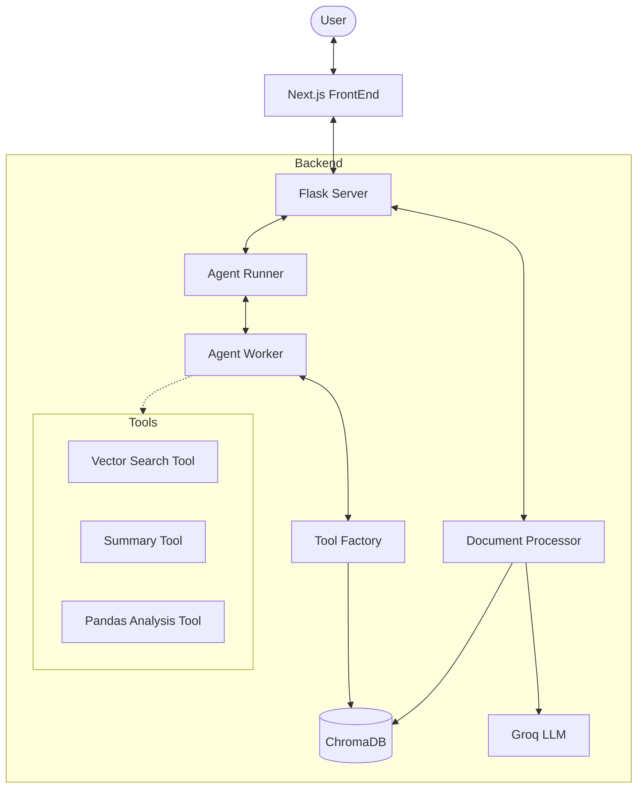

# Agentic RAG Project 🤖📄

An advanced, agentic Retrieval-Augmented Generation (RAG) system with a modern Web UI, supporting multi-hop reasoning over diverse document formats (PDF, TXT, MD) and specialized tabular data analysis (CSV, Excel).

## 🌟 Key Features

- **Agentic Reasoning**: Uses a multi-step reasoning loop (AgentRunner) to decompose complex queries and select the most relevant tools.
- **Multimodal Tooling**:
  - **Vector Search**: For semantic retrieval of facts and context from text documents.
  - **Document Summary**: For high-level overviews and thematic analysis.
  - **Pandas Data Analysis**: Specialized tool that generates and executes Python/Pandas code to answer queries about tabular data (CSV/Excel).
- **Modern Web UI**: A sleek Next.js-powered chatbot interface for seamless interaction.
- **Robust Backend**: Flask-based API with ChromaDB for persistent vector storage and Groq (Llama 3.3 70B) for high-speed inference.
- **Automated Document Processing**: Automatically chunks, embeds, and summarizes new files added to the `uploads/` directory.

## 🏗️ Architecture



## 🛠️ Tech Stack

- **Frontend**: Next.js, React, Tailwind CSS
- **Backend**: Python, Flask, Flask-CORS
- **LLM**: Groq (Llama-3.3-70b-versatile)
- **Embeddings**: SentenceTransformers (`all-MiniLM-L6-v2`)
- **Vector Database**: ChromaDB
- **Data Analysis**: Pandas, OpenPyXL
- **Document Parsing**: PyMuPDF (fitz)

## 🚀 Getting Started

### Prerequisites

- Python 3.9+
- Node.js 18+
- Groq API Key

### Backend Setup

1. **Clone the repository**:
   ```bash
   git clone https://github.com/Shivam-kr-manjhi/Agentic_Rag_Project.git
   cd Agentic_Rag_Project
   ```

2. **Install dependencies**:
   ```bash
   pip install -r requirements.txt
   ```

3. **Configure Environment**:
   Create a `.env` file in the root directory:
   ```env
   Groq_KEY=your_groq_api_key_here
   HuggingFace_Key=your_huggingface_key_here (optional)
   ```

4. **Run the server**:
   ```bash
   python server.py
   ```
   The backend will start on `http://localhost:8000`.

### Frontend Setup

1. **Navigate to the frontend directory**:
   ```bash
   cd FrontEnd/chatbot-ui
   ```

2. **Install dependencies**:
   ```bash
   npm install
   ```

3. **Run the development server**:
   ```bash
   npm run dev
   ```
   The UI will be available at `http://localhost:3000`.

## 📂 Project Structure

- `server.py`: Main Flask application and API entry point.
- `src/`: Core logic
  - `document_processor.py`: Handles file ingestion, chunking, and ChromaDB persistence.
  - `tool_factory.py`: Builds specialized tools (Vector, Summary, Pandas) for documents.
  - `agent_worker.py`: Performs semantic tool selection based on the query.
  - `agent_runner.py`: Implements the iterative reasoning loop.
  - `config.py`: Centralized configuration and LLM/Embedding initialization.
- `Data/` / `uploads/`: Document storage.
- `FrontEnd/`: Next.js chatbot application.

## 📝 Usage

1. **Upload Documents**: Place your PDFs, TXT, or CSV files in the `uploads/` folder or use the UI upload feature.
2. **Chat**: Ask complex questions like:
   - "Give me a summary of the project report." (Uses Summary Tool)
   - "What was the total revenue in the Q4 sales CSV?" (Uses Pandas Tool)
   - "Find details about the specific implementation of the agent worker." (Uses Vector Tool)
3. **Multi-hop**: The agent can combine information from multiple documents and tools to provide a comprehensive answer.

## 🤝 Contributing

Contributions are welcome! Please feel free to submit a Pull Request.
